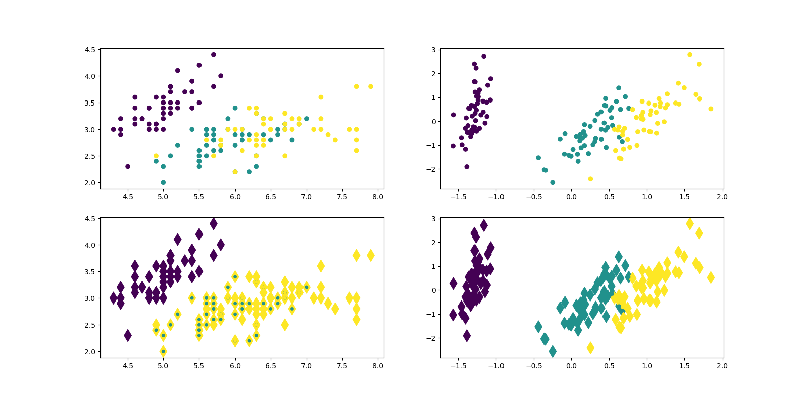
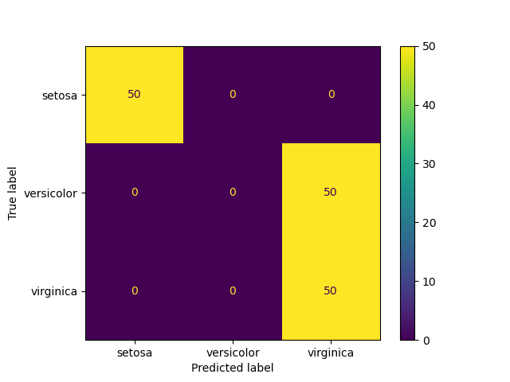
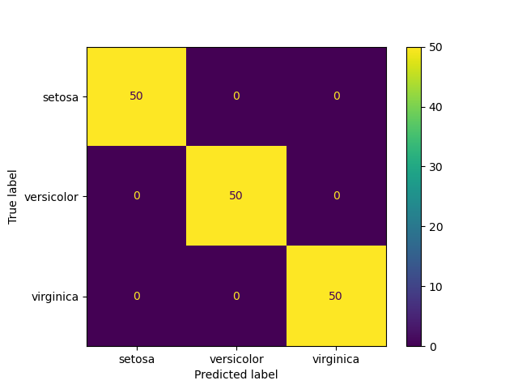

# RNA CLASSIFICAR DE PADRÕES - IRIS

## Descrição
Este código utiliza PCA para reduzir a dimensionalidade de dados do conjuntos Iris e treina duas MLPClassifiers para classificação,
exibindo vizualizações e matrizes de confusão antes e após a redução de dimnesionalidade.

## Arquivo
* "main.py": script em Python para RNA ClassificadorPCA. 
* "daset_grafico_dispersao.png": imagem do grafico de dispersao.
* "img_classificadorPCA.png": imagem da matrix de confusao com PCA.
* "img_classificador_semPCA.png": imagem da matriz de confusao sem PCA.

## Resultados
### 1. Gráfico de dispersão

### 2. Classificador sem PCA

### 3. Classificador com PCA
